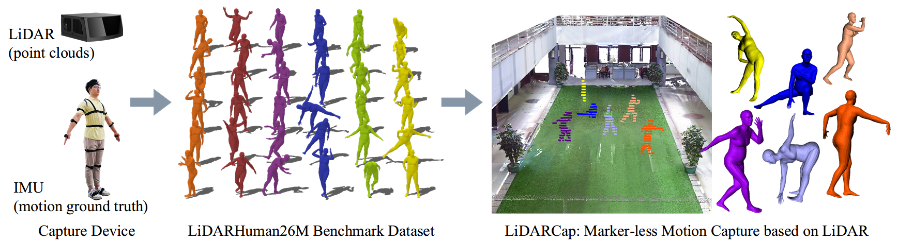

 

The proposed LiDARHuman26M benchmark dataset consists of synchronous LiDAR point clouds,
RGB images, and ground-truth 3D human motions obtained from professional IMU devices, covering diverse motions and
a large capture distance ranging. Based on LiDARHuman26M, we propose LiDARCap, a strong baseline motion capture
approach on LiDAR point clouds, which achieves promising results as shown on the right end. 

## Abstract
Existing motion capture datasets are largely short-range and cannot yet fit the need of long-range applications. We propose LiDARHuman26M, a new human motion capture dataset captured by LiDAR at a much longer range to overcome this limitation. Our dataset also includes the ground truth human motions acquired by the IMU system and the synchronous RGB images. We further present a strong baseline method, LiDARCap, for LiDAR point cloud human motion capture. Specifically, we first utilize PointNet++ to encode features of points and then employ the inverse kinematics solver and SMPL optimizer to regress the pose through aggregating the temporally encoded features hierarchically. Quantitative and qualitative experiments show that our  method outperforms the techniques based only on RGB images. Ablation experiments demonstrate that our dataset is challenging and worthy of  further research. Finally, the experiments on the KITTI Dataset and the Waymo Open Dataset show that our method can be generalized to different LiDAR sensor settings. The dataset and code is available at this [https URL](https://www.lidarhumanmotion.net/lidarcap).

## Dataset and code
Coming soon.

## Copyright
The LiDARHuman26M dataset is published under the [Creative Commons Attribution-NonCommercial-ShareAlike 3.0 License](https://creativecommons.org/licenses/by-nc-sa/3.0/).You must attribute the work in the manner specified by the authors, you may not use this work for commercial purposes and if you alter, transform, or build upon this work, you may distribute the resulting work only under the same license. Contact us if you are interested in commercial usage.

## Citation
